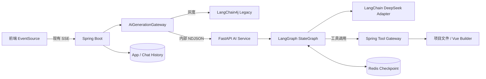

# AI 服务 LangChain + LangGraph 重构方案设计

## 1. 目标与边界

在保留 Spring Boot 业务后端的前提下，新增独立 Python AI 服务，将模型调用、生成编排、质量检查和工具决策迁移到 LangChain + LangGraph。Spring Boot 继续负责用户权限、应用与聊天记录、文件安全、构建、部署、下载以及对外 SSE。第一阶段不改业务表，不引入 PostgreSQL，不提供断线续跑或人工审批。

## 2. 总体架构



Python 使用 3.12，依赖版本锁定在 `ai-service/uv.lock`。DeepSeek 默认使用 `deepseek-chat`，复杂推理和质量检查可使用 `deepseek-reasoner`；模型适配遵循 LangChain 标准聊天模型接口，可替换为其他 OpenAI 兼容服务。Python 不访问 MySQL、项目目录或用户鉴权。

Redis checkpoint 使用独立 `yu-ai:langgraph:*` 前缀，`thread_id={appId}:{requestId}`，默认 TTL 24 小时。Redis 不可用时由配置决定是报告未就绪还是显式失败。

## 3. 工作流

```text
START -> input_guard -> context_prepare -> generation_branch
  HTML -> html_generator
  MULTI_FILE -> multi_file_generator
  VUE_PROJECT -> vue_agent <-> tool_dispatch
  -> artifact_validation -> project_build（仅 Vue）
  -> quality_review -> conditional_repair（最多 2 次）
  -> finalize -> END
```

Spring 将最近聊天历史随请求传入，checkpoint 只保存本次编排状态。HTML 和多文件分支使用结构化输出，解析后通过工具网关保存；Vue 分支使用 LangGraph Agent 工具循环，并限制节点步数、模型调用次数和工具调用次数。构建或质检失败进入修复节点，超过两次即失败，禁止无限回环。客户端断开时 Spring 取消上游请求，运行状态标记为 `cancelled`；发生写操作后旧引擎不得自动接管。

应用创建路由接口返回 `HTML`、`MULTI_FILE` 或 `VUE_PROJECT`，路由失败降级为 HTML。

## 4. 接口契约

对外接口保持不变：

```http
GET /api/apps/chat/gen/code?appId={id}&message={message}
Content-Type: text/event-stream
```

Spring 继续输出 `data: {"d":"..."}` 和最终 `event: done`，前端无需修改。

Python 内部接口：

| 接口 | 用途 |
| --- | --- |
| `POST /internal/v1/route` | 根据 `requestId/appId/prompt` 确定生成类型 |
| `POST /internal/v1/generations:stream` | 输入应用、用户、生成类型、消息和历史，返回 NDJSON |
| `POST /internal/v1/ai-tools/{toolName}` | 调用 Spring 文件与构建工具 |
| `POST /internal/v1/generations/{requestId}:cancel` | 取消运行 |
| `GET /health/live`、`GET /health/ready` | 健康检查（同时兼容 `/internal/v1/health/*`） |

流事件统一为 `content_delta`、`tool_started`、`tool_finished`、`node_status`、`completed`、`failed`，每个事件包含 `requestId`、递增序号、节点以及数据或错误字段。

工具网关提供文件读取、目录读取、写入、修改、删除、产物保存和 Vue 构建。请求使用 Bearer 服务令牌；按 `appId` 固定沙箱目录，使用 `requestId + toolCallId` 在 Redis 中幂等，并执行路径穿越、参数和超时校验。

## 5. Spring Boot 改造

- 增加 `AiGenerationGateway` 抽象，以及 Legacy 和 LangGraph 两个实现。
- 通过 `ai.engine=legacy|langgraph`、应用白名单和灰度比例选择引擎。
- 使用响应式 HTTP 客户端消费 Python NDJSON，映射为既有 `Flux<String>` 和 SSE 格式。
- Spring 统一落库用户消息、AI 结果、失败信息和工具调用历史。
- 将现有 Java `BaseTool` 能力封装为内部工具网关，工具接口只接受受控的应用沙箱路径。
- 灰度稳定后删除 LangChain4j 生成工厂、缓存、自定义覆盖类以及未接入生产的 `langraph4j` 工作流。
- AI、OSS、邮件密钥全部从环境变量或外部配置读取，并轮换历史泄露凭据。

## 6. 发布、观测与安全

先在测试环境完成契约测试和真实模型冒烟，再按应用白名单、灰度比例逐步提高 LangGraph 流量，稳定一个发布周期后设为默认并清理 Legacy。回滚只切换配置，不执行数据库迁移。

日志和指标统一关联 `requestId/appId/userId/engine/graphNode/model/tool/status`，采集成功率、首 Token 延迟、总耗时、Token 用量、修复次数、取消率和工具失败率。提示词、源码和工具参数默认不记录全文。服务部署在受控内网，只有 Spring 可以访问项目文件。

## 7. 测试计划

- Python：节点、条件边、三类分支、两次修复上限、checkpoint、取消和健康检查。
- Spring：NDJSON 解析、SSE 兼容、灰度选择、工具认证、幂等、路径沙箱和构建。
- 契约：路由、生成事件、工具调用、错误结构和事件顺序。
- 故障：模型超时、Redis 不可用、Python 5xx、工具超时、构建失败、客户端断连。
- 端到端：三种模式从 `/api/apps/chat/gen/code` 进入 LangGraph，生成项目可下载，Vue 可完成工具调用和真实构建。
- 回归：用户、应用、聊天记录、部署和下载接口行为保持不变。

## 8. 配置与验收标准

Python 配置见 `ai-service/.env.example`，服务令牌必须通过环境变量注入。验收要求包括：Python 测试和锁文件检查通过；Java 编译及相关测试通过；真实模型冒烟能够产生完整事件序列；工具请求无法越过应用沙箱；修复循环最多两次；切换 `ai.engine` 可在不改库的情况下回滚到 Legacy。
